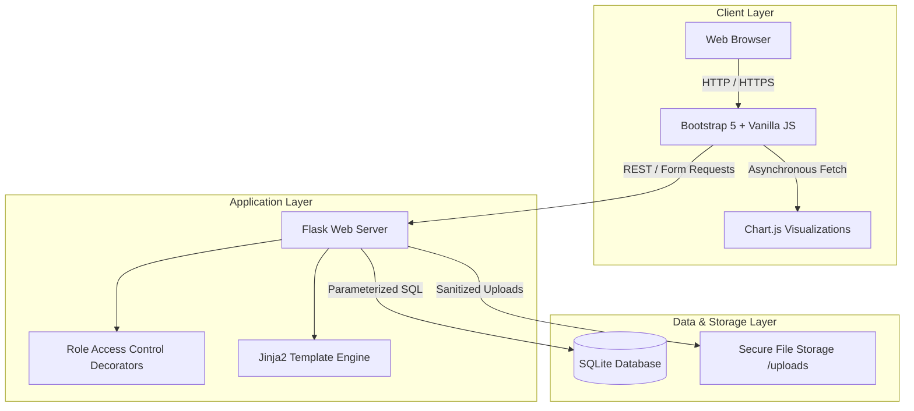
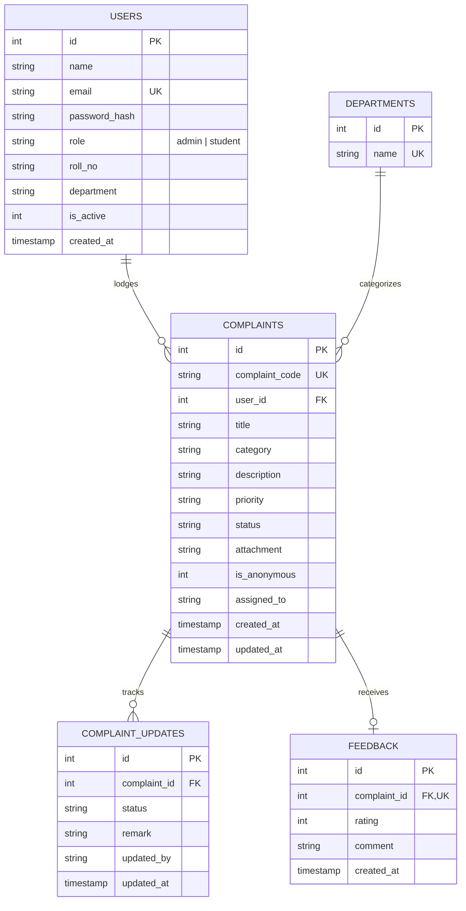

<div align="center">

# 🏛️ College Grievance Redressal & Resolution Tracking Portal

[](https://www.python.org/)
[](https://flask.palletsprojects.com/)
[](https://www.sqlite.org/)
[](https://getbootstrap.com/)
[](https://www.chartjs.org/)
[](https://opensource.org/licenses/MIT)
[](tests/)

*An enterprise-grade, student-centric grievance management and resolution tracking web application designed for collegiate and university administrations.*

[Features](#-key-features) • [Architecture](#-system-architecture) • [Getting Started](#-getting-started) • [Database Schema](#-database-schema) • [API & Workflows](#-api--workflows) • [License](#-license)

</div>

---

## 📌 Overview

Campus grievance redressal often suffers from lack of transparency, delayed communication, and unstructured record-keeping. The **College Grievance Redressal & Resolution Tracking Portal** provides a centralized, accountable platform to streamline the entire dispute and complaint lifecycle for higher education institutions.

Students can submit detailed concerns across academic and residential domains, optionally preserve anonymity, track real-time resolution milestones via interactive vertical steppers, and submit satisfaction feedback. Administrative staff gain actionable insights through dynamic visual analytics, automated CSV auditing, and role-based grievance escalation.

---

## ✨ Key Features

### 🎓 Student Portal
- **Role-Based Authentication**: Secure session lifecycle using salted cryptographic hashes (`Werkzeug`).
- **Grievance Lodgement**:
  - Auto-generated serial tracking code (e.g. `CMP-2025-0001`).
  - Categorization across institutional domains (Hostel, Mess, IT, Labs, Academics, Library, Transport, Accounts).
  - Priority levels (`Low`, `Medium`, `High`, `Urgent`).
  - Supporting document attachments (`.jpg`, `.png`, `.pdf` up to 5MB).
  - **Identity Protection Toggle**: Enables anonymous submission to prevent academic bias.
- **Interactive Tracking**: Real-time vertical stepper timeline displaying every status milestone, technician remarks, and audit timestamps.
- **Post-Resolution Rating**: 5-star rating system with feedback comments for institutional quality assurance.

### 🛡️ Administrator & Officer Panel
- **Executive Analytics Dashboard**:
  - Live KPI metric monitors: Pending, Under Review, In Progress, Resolved, and Rejected.
  - Asynchronous Chart.js visualizations:
    - Status distribution doughnut chart.
    - Category volume horizontal bar chart.
    - Priority severity breakdown pie chart.
  - Priority queue highlighting urgent and SLA-critical cases.
- **Master Registry Management**:
  - Multi-parameter filtering (by status, category, priority, keyword) with SQL pagination.
  - Granular status progression: `Pending` &rarr; `Under Review` &rarr; `In Progress` &rarr; `Resolved` / `Rejected`.
  - Officer assignment and mandatory action remark logging.
  - One-click **CSV Report Export** for institutional audits.
- **User Moderation & Domain Configuration**:
  - Account status moderation (Active / Blocked toggling).
  - Dynamic department/category configuration.

---

## 🏗️ System Architecture



---

## 🚀 Getting Started

### Prerequisites
- **Python 3.9+**
- **pip** package manager

### 1. Clone the Repository
```bash
git clone https://github.com/your-username/college-complaint-portal.git
cd college-complaint-portal
```

### 2. Create and Activate Virtual Environment
```bash
# Windows
python -m venv venv
venv\Scripts\activate

# macOS / Linux
python3 -m venv venv
source venv/bin/activate
```

### 3. Install Dependencies
```bash
pip install -r requirements.txt
```

### 4. Configure Environment Variables (Optional)
Copy the example environment template:
```bash
cp .env.example .env
```

### 5. Launch Application
```bash
python app.py
```
Open your browser and navigate to **`http://127.0.0.1:5000`**.

> **Note**: Database schema initialization (`schema.sql`) and sample seed records are automatically executed on the initial startup.

---

## 🧪 Running Tests

Execute the automated unit and integration test suite:
```bash
python -m unittest discover tests
```

---

## 🗄️ Database Schema

The SQLite schema enforces referential integrity through foreign keys and indexing:



---

## 🔐 Default Test Accounts

<details>
<summary>Click to view seeded test accounts</summary>

| Role | Email Address | Password | Profile |
|---|---|---|---|
| **Administrator** | `admin@college.com` | `Admin@123` | Dr. Rajesh Sharma (Dean, Grievance Redressal Cell) |
| **Student** | `rahul.sharma@college.com` | `Student@123` | Rahul Verma (CS Dept, Roll: 2024CS101) |
| **Student** | `priya.patel@college.com` | `Student@123` | Priya Patel (ECE Dept, Roll: 2024EC205) |

</details>

---

## 📂 Project Structure

```
college-complaint-portal/
├── app.py                      # Flask routes, RBAC decorators, APIs & error handlers
├── config.py                   # Centralized application configuration
├── database.py                 # SQLite connection manager, query helpers & seeders
├── schema.sql                  # Database DDL with tables, indexes & constraints
├── requirements.txt            # Project dependencies
├── .env.example                # Environment variables template
├── .gitignore                  # Git ignore rules for virtualenvs, db & uploads
├── LICENSE                     # MIT License
├── README.md                   # Project documentation
├── tests/
│   ├── __init__.py
│   └── test_app.py             # Automated unit & integration test suite
├── static/
│   ├── css/
│   │   └── style.css           # Custom stylesheets, vertical stepper, badge themes
│   ├── js/
│   │   ├── main.js             # Client validation, file checks & UI utilities
│   │   └── charts.js           # Chart.js dashboard integration
│   └── uploads/                # Upload directory for grievance attachments
└── templates/
    ├── base.html               # Master layout with responsive navbar & toasts
    ├── index.html              # Landing page with live metric counters
    ├── track.html              # Public/Student status tracking stepper
    ├── about.html              # Redressal charter & SLA policy matrix
    ├── contact.html            # Helpdesk contact & FAQ accordion
    ├── 404.html                # Custom 404 error page
    ├── 500.html                # Custom 500 error page
    ├── auth/                   # Authentication templates (Login & Register)
    ├── student/                # Student dashboard, lodgement & feedback views
    └── admin/                  # Admin dashboard, grievance management & users
```

---

## 🛡️ Security Implementation

- **Password Storage**: Passwords are never stored in plaintext; salted hashes are generated via `werkzeug.security.generate_password_hash` (`scrypt`).
- **SQL Injection Mitigation**: Strict adherence to parameterized queries (`?` parameter binding) across all database interactions.
- **Upload Hardening**: Restrictive extension whitelist (`png`, `jpg`, `jpeg`, `pdf`), filename sanitization via `secure_filename`, and size capped at 5MB.
- **Role Isolation**: Custom Python function decorators guarantee uncompromised separation of student and admin privileges.

---

## 📜 License

Distributed under the **MIT License**. See [`LICENSE`](LICENSE) for more information.
